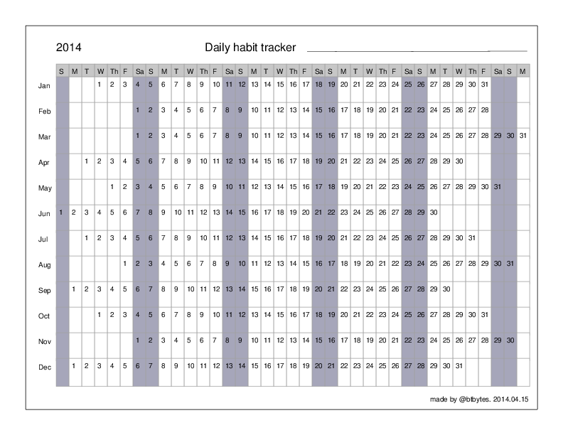

The [daily-habit-tracker.js](daily-habit-tracker.js) generates a
calendar using the [jsPDF](http://parall.ax/products/jspdf) library.

The output of this js program looks like this
[PDF](http://files.btbytes.com/dht/daily-habit-tracker-20140415.pdf).

## To play with the code

Paste [this code](http://files.btbytes.com/dht/daily-habit-tracker.js) into the text area
of a [jsPDF playground](http://files.btbytes.com/jspdf/) and download the PDF.
Change the `year` variable to get calendar for future years.

